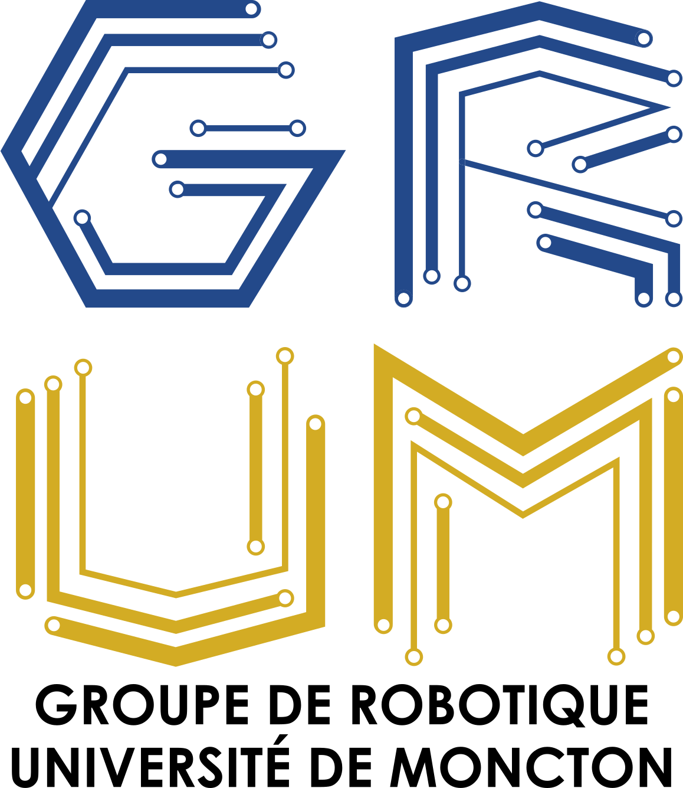

# PFE_Eurobot_2026
<table>
  <tr>
    <td></td>
    <td></td>
  </tr>
</table>

### Tout le code pour le projet.

Svp créer un nouveau folder pour chaque partie et indiquer son utilité dans le tableau.


| Dir                | Purpose       |
| ------------------ |:------------------:|
| ws                 | main ros2 colcon workspace |
| pio                | ESP32 Code      |
| Other       | other files |

## First time setup
### WSL, ROS, and Libs
- Download Ubuntu 22.04
- Download ROS2 Jazzy
- Download all apt packages (listed below)

### Software
- Download vscode
  - Install Platform IO
  - run `sudo apt install -y python3-venv` in project folder
- Download WSL2

### Github login and pull code
- Open terminal
- Type :
```
wsl
cd
code .
```
- `ctr` + `shift` + `p`
- Type `Git: Clone`
- Log in to Github
- Select jacovaut/PFE_Eurobot_2026
- click on open

Congrats, you now have all the code! To build and run the code, please see the Ros2 section. To use git, please refer to the next section.

*** Your Github credentials are only valid in vscode. Run all git commands in a vscode terminal ***


## How to use Git
- Use comprehensive commit messages
- Don't be dumb

### To add a new feature
- `git checkout -b feature/some-new-feature`
- work and commit
- `git push origin feature/some-new-feature`
- Pull request in main

### Submodules
To add :
- `git submodule add -b BRANCH https://github.com/...`

To get :
- `git submodule init && git submodule update`


## Ros2

Example Ros2 workspace structure :
```
ws
├───build (ignore)
├───install (Running files are in here)
├───log
└───src (Code)
    ├───package_1 (Example packages (use git submodules))
    ├───package_2
    └───pfe (main code)
        ├───config (.yaml config files)
        ├───description (robot description and rviz files)
        │   ├───rviz
        │   └───urdf
        ├───launch (all launch files)
        ├───maps
        ├───resource
        ├───test
        ├───pfe (custom nodes)
        └───worlds (gazebo worlds)
```
The build, install and log folders should be in ignored by git.

For premade packages, use sudo apt install ros-jazzy-PACKAGE_NAME or git submodules


- To build the workspace
    - cd ~/PFE_EUROBOT_2026/ws
    - colcon build --symlink-install
- To build a specific package
    - cd ~/PFE_EUROBOT_2026/ws
    - colcon build --symlink-install --packages-select PACKAGE
### Ros2 packages

|Package|Apt/Submodule|
|---|----|
|nav2|apt|
|Gazebo|apt|
|rviz|apt|
|xacro|apt|
|joint state publisher|apt|
|teleop twist keyboard|apt|
|micro_ros_setup|submodule|
|lidar (idk what lidar?)|submodule?|

## Misc
- If sudo apt install fails, try
```
sudo apt update
sudo apt install <Program>
```
- To use dedicated graphics card in WSL (Current shell)
```
export MESA_D3D12_DEFAULT_ADAPTER_NAME="NVIDIA GeForce RTX 3060 Laptop GPU"
```
- To use dedicated graphics card in WSL (All shells)
```
echo 'export MESA_D3D12_DEFAULT_ADAPTER_NAME="NVIDIA GeForce RTX 3060 Laptop GPU"' >> ~/.bashrc
source ~/.bashrc
```
- Create Micro_ros agent
```
ros2 run micro_ros_setup create_agent_ws.sh
```
- Build Micro_ros agent
```
ros2 run micro_ros_setup build_agent.sh
```
- Attach Micro_ros agent
```
ros2 run micro_ros_agent micro_ros_agent serial --dev /dev/ttyUSBX -v6
```

## Terminal tools
```
cd <Directory> (Go to folder)
ls <Directory> (List all files and folder in current directory)
sudo <Command> (Execute command as admin)
nano <File_Name> (Command line text editor)
mkdir <Name> (Create folder)
cat <File_Name> (Print text in file)
cp <File_Path1> <File_Path2> (Copy file from File_Path1 and paste to File_Path2)
mv <File_Path1> <File_Path2> (Move File from File_Path1 to File_Path2)
code <File_Path / Folder_Path> (Open file or folder in vscode)
```

## TO DO
- Init
  - [x] README
  - [x] Add pio project
  - [x] Configure Ros2 ws
- Ros2 Packages install
  - [ ] nav2
  - [ ] Robot localization
  - [ ] joy
- Ros2 Setup
  - [ ] Config files
    - [ ] nav2
    - [ ] lidar
  - [ ] launch files
    - [ ] Core
    - [ ] Lidar
    - [ ] Navigation
  - [ ] URDF
  - [ ] maps
- ESP32 Motor
  - [ ] Drive motor
  - [x] Comunication
  - [ ] Inverse kinematics
- ESP32 Odom
  - [ ] Read Counter Clicks
  - [x] Comunication
  - [ ] Kinematics

.jpg)
